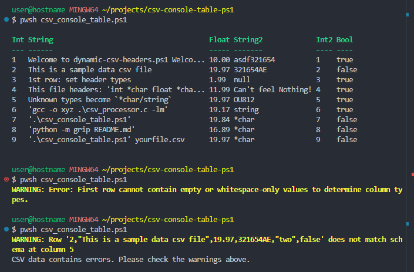

# CSV Console Table in PowerShell
This PowerShell implementation provides dynamic column type detection and data validation while creating clean, aligned console output - making it ideal for consistent data snapshots and type verification.

## Features
- Dynamically detects and validates column types from CSV data
- Supports multiple data types: Int, Float, Bool, String, and Null
- Creates formatted console tables with proper alignment
- Validates subsequent rows against the detected schema
- Handles duplicate column names with automatic suffixes
- Limits output width with smart string truncation
- Saves output to both console and file

## Example Input CSV ([`default.csv`](default.csv)):
```csv
1,Welcome to dynamic-csv-headers.ps1 Welcome to csv_console_table.ps1,10.00
2,This is a sample data csv file,19.97
3,1st row: set header types,1.99
4,This file headers: 'int *char float *char',11.99
5,Unknown types become `*char/string`,19.97
6,'gcc -o xyz .\csv_processor.c -lm',19.17
7,'.\csv_console_table.ps1',19.84
8,'python -m grip README.md',16.89
9,'.\csv_console_table.ps1' yourfile.csv ,19.97
```

## Example Output 


## Usage
- **PowerShell**:
   - .\csv_console_table.ps1 .\yourfile.csv (optional)

- **BASH**:
   - pwsh csv_console_table.ps1 yourfile.csv (optional)

## Parameters
 - DefaultFile: Path to CSV file (default: "default.csv")
 - rowLimit: Maximum rows to process (range: 1-1000, default: 10)

## Data Type Detection
- The script automatically detects these column types:
   - Int (whole numbers)
   - Float (decimal numbers)
   - Bool (true/false)
   - String (text)
   - Null (empty or null values)

## Limitations
- The script assumes the first row contains column headers.
- Duplicate column names are not supported.
- The output width is limited to 120 characters.

## Requirements
- PowerShell 7.0+
- Read access to CSV files

## Purpose
- This PowerShell implementation offers:
   - Dynamic type detection and validation
   - Clean console output formatting
   - Data integrity verification
   - Platform independence
   - Educational resource for PowerShell scripting practices

## Alternatives
- **PowerShell**:
   - Import-Csv "data.csv" | Format-Table

- **BASH**:
   - csvcut -c 1,2,3 default.csv

## License
 - This project is licensed under the MIT License. See the [LICENSE](LICENSE) file for details.
